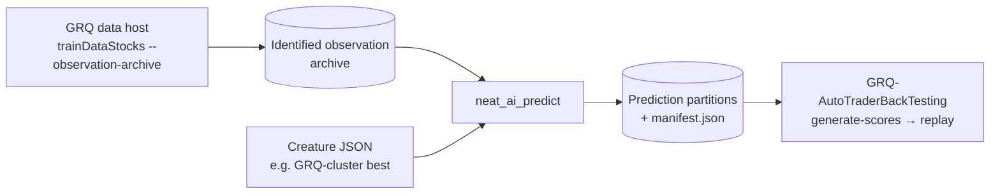

# NEAT-AI-Predict

Bulk inference for NEAT-AI creatures. `neat_ai_predict` runs **one** creature
over **every** stock/date row of a GRQ identified observation archive —
about twenty years of observations, written while GRQ generates its training
data — and writes per-row predictions with full provenance.

It exists so GRQ-AutoTraderBackTesting can build historical day sheets and
backtest AutoTrader policies against them without re-computing a single
observation. The programme is tracked in
[GRQ-AutoTraderBackTesting #115](https://github.com/stSoftwareAU/GRQ-AutoTraderBackTesting/issues/115);
the consumer-side specification is
[#111](https://github.com/stSoftwareAU/GRQ-AutoTraderBackTesting/issues/111)
there, and the implementation plan is [issue #1](../../issues/1) here.



## Status

The repository holds the command-line skeleton, request validation and the
fleet install script. The engine is not in this build: a validated `predict`
request exits `69` (`EX_UNAVAILABLE`) naming [issue #1](../../issues/1).

| Issue | Delivers |
| --- | --- |
| [#2](../../issues/2) | Scaffold: crate, CLI, `runlib.sh` (this) |
| [#3](../../issues/3) | Archive reader: dataset chain, shard index, SHA-256 verification, replacement precedence |
| [#4](../../issues/4) | Creature loading, input-width contract, activation parity with `neat-core` |
| [#5](../../issues/5) | Output partitions and provenance manifest |
| [#6](../../issues/6) | Parallel execution and a rows/s benchmark |
| [#7](../../issues/7) | `family-sync` CI job for `scripts/runlib.sh` |

## Usage

```bash
neat_ai_predict predict \
  --creature  ../GRQ-cluster/creature.json \
  --archive   ../Observations/116/b448fe6b43db398e \
  --dataset   20261004T093634Z-31163-6lgt1w \   # optional; default datasets/latest.json
  --from 2007-01-01 --to 2026-10-01 \           # optional, inclusive
  --output    ../Predictions/cluster-2026-10-04

neat_ai_predict --version
```

Exit codes follow BSD `sysexits.h`:

| Code | Meaning |
| --- | --- |
| `0` | Predictions written |
| `2` | clap rejected the arguments (unknown flag, missing value, bad date) |
| `64` | The request refused itself: `--from` after `--to`, an unsafe `--dataset`, an empty path |
| `66` | `--creature` is not a file or `--archive` is not a directory |
| `69` | The engine is not implemented in this build |

Every refusal is printed on stderr. Nothing is ever skipped quietly.

### Input: the GRQ identified observation archive

The archive format is owned by GRQ and specified in its
`docs/Identified_Observation_Archive.md`. In short:

- `--archive` names a **fingerprint root**, `<root>/<extension>/<fingerprint>`.
  Rows under a different fingerprint were assembled under different feature
  semantics and are never mixed.
- Shards are `<yyyy>/<mm>/<prefix>/<chunk>.bin`: exactly `inputCount`
  little-endian `f32` values per row, in feature order, with no target. The
  sibling `<chunk>.index.json` carries the semantics, the shard's SHA-256 and
  one `{symbol, date, exchange?, alias?, row}` entry per row.
- `datasets/<id>.json` are immutable snapshots; `datasets/latest.json` points
  at the newest. A run reads only the shards its chosen snapshot references.

### Contract rules

- The creature's top-level `input` / `output` counts are authoritative and must
  be at least 1. A creature narrower than the archive is extended with
  unconnected inputs; a creature **wider** than the archive is refused — that
  would be a contraction, and GRQ never contracts an observation set.
- Activation goes through the same `neat-core` engine the fleet's
  `rust_scorer` uses, so predictions are comparable with fleet scores. There
  is no fallback engine.
- A row whose output is not finite is reported by `symbol@date` and never
  written as a number.
- Every shard's SHA-256 is verified before a row of it is used.

### Output

One partition per `yyyy/mm/prefix` (`output_count` little-endian `f64` per
row plus an index JSON) and a top-level `manifest.json` recording the creature
UUID and file hash, the archive fingerprint and dataset id, the engine and
`neat_ai_predict` versions, and per-partition row counts — so any consumer can
prove which model scored which rows. Details in [#5](../../issues/5).

## Installing on a fleet host

Fleet hosts do not run `cargo build` on every task.
[`scripts/runlib.sh`](./scripts/runlib.sh) installs
`~/.cargo/bin/neat_ai_predict`, stamps it with
`~/.cargo/bin/.neat_ai_predict.version` — the crate semver, written last —
prints the installed path on stdout, and removes `target/` after a successful
install. A second run at the same crate version prints
`[neat_ai_predict] already installed v<x>` on stderr and runs no cargo command
at all. A failed install keeps `target/` and leaves the previously installed
binary and its stamp untouched. Delete the stamp to force a rebuild; there is
no force flag.

That file is **not** this repository's to edit. It is copied byte-for-byte
from `scripts/runlib.sh` on
[NEAT-AI-core](https://github.com/stSoftwareAU/NEAT-AI-core) `Develop`
(core #680), where every NEAT-AI Rust sibling takes it from — behaviour
changes are made there and re-copied outward. `scripts/test-runlib.sh` asserts
the contract that copy owes this crate against fixture checkouts with a
`cargo` shim, so "compiled nothing" is read off a log of every invocation
rather than assumed. The CI job that refreshes the copy on every pull request
is [#7](../../issues/7).

It needs `cargo`, `rustc` and `jq` on the host — `jq` is what reads
`cargo metadata` — and exits non-zero naming the missing one rather than
guessing. It never installs a toolchain and never edits `RUSTFLAGS`.

GRQ wires a sibling in through `worker/shared/neat_ai_runlib.sh`
(`grq_neat_ai_runlib_ensure`) and lists it in
`quality/neat_ai_runlib_siblings.list`; that half is filed in GRQ once the
binary can predict.

## Build and quality gate

Prerequisites:

- Rust via [rustup](https://rustup.rs). `rust-toolchain.toml` pins the
  compiler, so rustup installs the right version on first use.
- `shellcheck`, `codespell`, `markdownlint-cli2`, `actionlint`, `jq`,
  `cargo-deny` and `cargo-audit` for the full gate. `./quality.sh` names the
  install command for any that are missing.

```bash
cargo build                # debug build
cargo build --release      # optimised build
cargo test                 # unit, public-API and doc tests
cargo clippy --all-targets -- -D warnings   # lint
cargo fmt --all            # format
./quality.sh               # the full local gate; run it before every push
```

`./quality.sh` runs these checks, and every one must pass:

1. `bash -n` and ShellCheck on every shell script.
2. The script tests, including `scripts/test-runlib.sh`.
3. codespell.
4. markdownlint.
5. actionlint.
6. `cargo fmt --check`, Clippy and `cargo check`.
7. The tests and the documentation build.
8. `cargo deny` and `cargo audit`.

CI runs the same checks on every pull request into `Develop`, `main` or
`milestone/*`.

### Code style

- **Formatting.** `rustfmt` with default settings.
- **Lints.** The `[workspace.lints]` tables in `Cargo.toml` deny:
  - every warning;
  - `unsafe_code` and missing documentation;
  - `unwrap()` and `expect()` outside tests;
  - `dbg!` and `todo!`.
- **Tests.** `clippy.toml` relaxes the `unwrap()`, `expect()` and print
  lints inside tests only.
- **Coding and test standards.** See
  [CONTRIBUTING.md](./CONTRIBUTING.md), including **Unit, Integration and
  Benchmark Tests**.

### Build profiles

- **`[profile.dev]`** uses `debug = "line-tables-only"`, which keeps rebuilds
  fast.
- **`[profile.release]`** uses `opt-level = 3`, `lto = "fat"` and
  `codegen-units = 1`, which gives the fastest artefact.
- **`.cargo/config.toml`** adds `-C target-cpu=native` for builds on the
  machine that runs the binary — the fleet pattern, since `runlib.sh` builds
  on the host that runs it. `./quality.sh` and CI set `RUSTFLAGS`, which
  replaces it, so their builds stay portable.

## Branches and pull requests

- **Branches.** Branch from `Develop`, as
  `<type>/<issue-number>-<short-slug>`.
- **Pull requests.** Open the pull request back into `Develop`, or into a
  `milestone/<slug>` branch for staged work.
- **Commits.** Reference the issue, e.g. `Fix: refuse a wider creature
  (Issue #4)`.

[CONTRIBUTING.md](./CONTRIBUTING.md) has the full conventions.

## CI workflows

| Workflow | What it checks |
| --- | --- |
| `cargo-quality.yml` | Formatting, Clippy, `cargo check`, tests, docs and `cargo deny`. A `quality` job aggregates the results. |
| `cargo-audit.yml` | [RustSec](https://rustsec.org/) advisories, on every PR and weekly. |
| `cargo-upgrade.yml` | Weekly `cargo update` pull request. Holds back versions under 24 hours old. |
| `shellcheck.yml` | `bash -n` and ShellCheck. |
| `markdown-lint.yml` | markdownlint and codespell. |
| `actionlint.yml` | Workflow YAML lint. |
| `gitleaks.yml` | Secret scanning of the PR's commits. |
| `semgrep.yml` | [Static application security testing (SAST)](https://en.wikipedia.org/wiki/Static_application_security_testing). |
| `codeql.yml` | GitHub CodeQL scanning. |
| `dependency-review.yml` | New-dependency vulnerability and licence review. |
| `sbom.yml` | [Software Bill of Materials (SBOM)](https://en.wikipedia.org/wiki/Software_bill_of_materials) in CycloneDX format, uploaded as an artefact. |

Every third-party action is pinned to a full commit SHA, with its version in
a trailing comment. Downloaded binaries are pinned by version and SHA-256.
Dependabot (`.github/dependabot.yml`) and Renovate (`renovate.json`) keep
the pins and crates current. Both quarantine new external releases; see
[SECURITY.md](./SECURITY.md).

## Repository settings

This repository was created from
[template-rust](https://github.com/stSoftwareAU/template-rust) and its
GitHub settings (merge options, `Develop` and `milestone/**` rulesets, labels,
Actions allow-list, security features) were applied with the template's
`scripts/apply-repo-settings.sh`. Re-run that script from the template when
the template's settings change.

## Layout

| Path | Purpose |
| --- | --- |
| `src/lib.rs` | Library: the request model, market dates, dataset-id and request validation, with unit tests. |
| `src/main.rs` | Binary: clap argument parsing, filesystem checks, exit-code mapping. |
| `tests/` | Public-API tests, run in process. |
| `scripts/runlib.sh` | Canonical NEAT-AI-core install script (do not edit here). |
| `scripts/test-runlib.sh` | Contract tests for that copy, with a `cargo` shim. |
| `scripts/` | Other shell helpers (quarantined `cargo update`, spelling, repository settings) and their tests. |
| `.github/` | Workflows, the shared `setup-rust` action, Dependabot and CODEOWNERS. |

## Licence

[Apache-2.0](./LICENSE).
