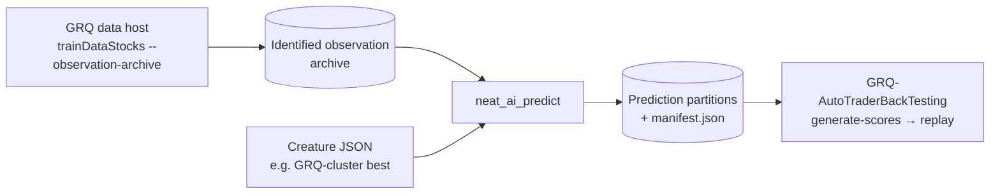

# NEAT-AI-Predict

Bulk inference for NEAT-AI creatures. `neat_ai_predict` runs **one** creature
over **every** stock/date row of a GRQ identified observation archive —
about twenty years of observations, written while GRQ generates its training
data — and writes per-row predictions with full provenance.

It exists so GRQ-AutoTraderBackTesting can build historical day sheets and
backtest AutoTrader policies against them without re-computing a single
observation. The programme is tracked in
[GRQ-AutoTraderBackTesting #115](https://github.com/stSoftwareAU/GRQ-AutoTraderBackTesting/issues/115);
the consumer-side specification is
[#111](https://github.com/stSoftwareAU/GRQ-AutoTraderBackTesting/issues/111)
there, and the implementation plan is [issue #1](../../issues/1) here.



## Status

The engine is implemented: archive reader ([#3](../../issues/3)), activation
with the width contract ([#4](../../issues/4)), GRQ-format output with a
provenance manifest ([#5](../../issues/5)), parallel execution and a benchmark
([#6](../../issues/6)), and the `runlib.sh` family-sync job
([#7](../../issues/7)). The plan is [issue #1](../../issues/1).

## Usage

```bash
neat_ai_predict predict \
  --creature  ../GRQ-cluster/network.json \
  --archive   ../Observations/116/b448fe6b43db398e \
  --output    ../Predictions/cluster-2026-10-04
```

Optional flags:

- `--dataset <id>` reads a pinned snapshot. The default is the snapshot
  `<archive>/latest.json` names.
- `--from <YYYY-MM-DD>` and `--to <YYYY-MM-DD>` restrict the inclusive date
  range.
- `--version` prints the version.

Progress goes to stderr. Exit codes follow BSD `sysexits.h`:

| Code | Meaning |
| --- | --- |
| `0` | Every row in range was predicted and written, or `--output` already held this exact run |
| `2` | clap rejected the arguments (unknown flag, missing value, bad date) |
| `3` | Finished, but some rows produced a non-finite output; they are listed in `manifest.json` and not written |
| `64` | The request refused itself: `--from` after `--to`, an unsafe `--dataset`, an empty path |
| `65` | The archive or creature is malformed or incompatible (bad index, hash mismatch, wider creature, recurrent creature) |
| `66` | The creature or an archive file cannot be read |
| `73` | `--output` already holds a different run; it is never overwritten |
| `74` | Output could not be written |

### Input: the GRQ identified observation archive

The archive format is owned by GRQ and specified in its
`docs/Identified_Observation_Archive.md`:

```text
<fp>/latest.json                          {"datasetId": …} — the newest snapshot
<fp>/datasets/<id>.json                   immutable manifest, chained to its predecessor
<fp>/<yyyy>/<mm>/<prefix>/<chunk>.bin     inputCount little-endian f32 per row, no target
<fp>/<yyyy>/<mm>/<prefix>/<chunk>.index.json
```

- **The fingerprint root.** `--archive` names
  `<root>/<extension>/<fingerprint>`. The reader refuses a root whose two
  last components differ from the extension and fingerprint the snapshot
  declares, so rows assembled under other semantics are never mixed in.
- **Snapshots chain.** A snapshot is its manifest plus every ancestor. Rows
  resolve oldest publication first, with shards in manifest order, so a
  restated row supersedes the earlier copy. This is GRQ's own rule.
- **Nothing is trusted.** The reader checks:
  - every dataset id and shard path, before it is joined onto the root;
  - every index, against its manifest entry and the snapshot's semantics;
  - every row identity, against its partition;
  - every payload, by size and SHA-256 before any of its rows is used.

  It also refuses any non-finite observation, because GRQ never archives
  one.

### Activation and the contract rules

- **Width counts.** The creature's top-level `input` / `output` are
  authoritative and must be at least 1.
- **Narrower creatures.** A creature narrower than the archive runs as if
  extended with unconnected inputs: GRQ's "extend, never contract".
- **Wider creatures** are refused.
- **Recurrent creatures.** Only a `forwardOnly` creature is accepted. A
  recurrent creature's predictions would depend on row order.
- **The kernel.** Rows run through `neat-core`'s scalar
  `CompiledNetwork::activate_into`, the crate the fleet's `rust_scorer`
  scores with. Rows are spread across the rayon pool, and the bulk path is
  bit-identical to `neat-core`'s reference `activate`.
- **Agreement with GRQ's daily scoring.** Measured against
  `@stsoftware/neat-ai` 7.0.48 `creature.activate`, the call GRQ's daily
  scoring makes. The test used GRQ's production cluster creature (2 511
  inputs, 8 236 neurons) over 20 000 rows:
  - 18 961 outputs were bit-identical;
  - the largest difference was 1.9e-6 (about 3e-7 relative), from native
    `libm` against JavaScript `Math` in `tanh`/`exp`.

  `neat-core`'s batched SIMD kernel was measured too, and agreed less
  (1 654 / 2 000, max 2.4e-6).

### Output

The output layout is GRQ's prediction cache
(`src/inference/PredictionStore.ts`), so GRQ's TypeScript and
GRQ-AutoTraderBackTesting read it without this crate:

```text
<output>/<yyyy>/<mm>/<prefix>.bin          outputCount little-endian f64 per row
<output>/<yyyy>/<mm>/<prefix>.index.json   schema grq.predictions.partition/1
<output>/manifest.json                     schema neat-ai-predict.run/1
```

- **Index rows.** Each index row is `{symbol, date, exchange?, row}`.
- **Manifest contents.** The manifest records:
  - the identity key GRQ's `predictionIdentity` would compute, plus its
    parts: creature, archive semantics, dataset, engine and engine version;
  - the `neat-core` git source and commit, the date range and the dataset
    chain;
  - every partition's row count and SHA-256;
  - the rows refused for a non-finite output.
- **Creature identity.** A creature is identified as `sha256:<file hash>`.
  GRQ creature files carry no UUID field.
- **Atomic writes.** A run is written into a staging directory beside
  `<output>` and renamed into place after the manifest, so a killed run
  leaves nothing that looks finished.
- **Repeat runs.** Repeating a run whose output already exists is a no-op.
  Pointing a different run at it is refused.

### Performance

Measured on a 10-core Apple-silicon host that was not idle (load average
about 3), so treat these as indicative:

| Measurement | Rows/s |
| --- | --- |
| GRQ cluster creature, activation only, 1 thread | ~8 800 |
| GRQ cluster creature, activation only, 10 threads | ~60 000 |
| End to end, 20 000 rows in 630 partitions, including hashing and writing | ~31 700 |

TypeScript `HistoricalInferenceProvider` on the WASM engine was measured at
about 37 000 rows/s cold, per GRQ's own measurement. At that scale a 20-year
archive is minutes. Re-measure with:

```bash
cargo bench --bench predict -- --creature ../GRQ-cluster/network.json
./parity/run.sh ../GRQ-cluster/network.json 20000
```

## Installing on a fleet host

Fleet hosts do not run `cargo build` on every task.
[`scripts/runlib.sh`](./scripts/runlib.sh) installs
`~/.cargo/bin/neat_ai_predict`, stamps it with
`~/.cargo/bin/.neat_ai_predict.version` — the crate semver, written last —
prints the installed path on stdout, and removes `target/` after a successful
install. A second run at the same crate version prints
`[neat_ai_predict] already installed v<x>` on stderr and runs no cargo command
at all. A failed install keeps `target/` and leaves the previously installed
binary and its stamp untouched. Delete the stamp to force a rebuild; there is
no force flag.

That file is **not** this repository's to edit. It is copied byte-for-byte
from `scripts/runlib.sh` on
[NEAT-AI-core](https://github.com/stSoftwareAU/NEAT-AI-core) `Develop`
(core #680), where every NEAT-AI Rust sibling takes it from — behaviour
changes are made there and re-copied outward. `scripts/test-runlib.sh` asserts
the contract that copy owes this crate against fixture checkouts with a
`cargo` shim, so "compiled nothing" is read off a log of every invocation
rather than assumed. The `family-sync` workflow fetches core's copy on every
pull request, commits a refresh onto the PR branch when the two differ, and
fails the run so the re-run gates the canonical bytes.

It needs `cargo`, `rustc` and `jq` on the host — `jq` is what reads
`cargo metadata` — and exits non-zero naming the missing one rather than
guessing. It never installs a toolchain and never edits `RUSTFLAGS`.

GRQ wires a sibling in through `worker/shared/neat_ai_runlib.sh`
(`grq_neat_ai_runlib_ensure`) and lists it in
`quality/neat_ai_runlib_siblings.list`; that half is filed in GRQ once the
binary can predict.

## Build and quality gate

Prerequisites:

- Rust via [rustup](https://rustup.rs). `rust-toolchain.toml` pins the
  compiler, so rustup installs the right version on first use.
- `shellcheck`, `codespell`, `markdownlint-cli2`, `actionlint`, `jq`,
  `cargo-deny` and `cargo-audit` for the full gate. `./quality.sh` names the
  install command for any that are missing.

```bash
cargo build                # debug build
cargo build --release      # optimised build
cargo test                 # unit, public-API and doc tests
cargo clippy --all-targets -- -D warnings   # lint
cargo fmt --all            # format
./quality.sh               # the full local gate; run it before every push
```

`./quality.sh` runs these checks, and every one must pass:

1. `bash -n` and ShellCheck on every shell script.
2. The script tests, including `scripts/test-runlib.sh` and
   `scripts/test-script-refs.sh` (every sourced or called script path
   resolves — issue #29).
3. codespell.
4. markdownlint.
5. actionlint.
6. `cargo fmt --check`, Clippy and `cargo check`.
7. The tests and the documentation build.
8. `cargo deny` and `cargo audit`.

CI runs the same checks on every pull request into `Develop`, `main` or
`milestone/*`, except `scripts/test-cargo-update-quarantined.sh` and
`scripts/test-script-refs.sh`: no workflow runs those two, so only
`./quality.sh` does.

### Code style

- **Formatting.** `rustfmt` with default settings.
- **Lints.** The `[workspace.lints]` tables in `Cargo.toml` deny:
  - every warning;
  - `unsafe_code` and missing documentation;
  - `unwrap()` and `expect()` outside tests;
  - `dbg!` and `todo!`.
- **Tests.** `clippy.toml` relaxes the `unwrap()`, `expect()` and print
  lints inside tests only.
- **Coding and test standards.** See
  [CONTRIBUTING.md](./CONTRIBUTING.md), including **Unit, Integration and
  Benchmark Tests**.

### Build profiles

- **`[profile.dev]`** uses `debug = "line-tables-only"`, which keeps rebuilds
  fast.
- **`[profile.release]`** uses `opt-level = 3`, `lto = "fat"` and
  `codegen-units = 1`, which gives the fastest artefact.
- **`.cargo/config.toml`** adds `-C target-cpu=native` for builds on the
  machine that runs the binary — the fleet pattern, since `runlib.sh` builds
  on the host that runs it. `./quality.sh` and CI set `RUSTFLAGS`, which
  replaces it, so their builds stay portable.

## Branches and pull requests

- **Branches.** Branch from `Develop`, as
  `<type>/<issue-number>-<short-slug>`.
- **Pull requests.** Open the pull request back into `Develop`, or into a
  `milestone/<slug>` branch for staged work.
- **Commits.** Reference the issue, e.g. `Fix: refuse a wider creature
  (Issue #4)`.

[CONTRIBUTING.md](./CONTRIBUTING.md) has the full conventions.

## CI workflows

| Workflow | What it checks |
| --- | --- |
| `cargo-quality.yml` | Formatting, Clippy, `cargo check`, tests, docs and `cargo deny`. A `quality` job aggregates the results. |
| `cargo-audit.yml` | [RustSec](https://rustsec.org/) advisories, on every PR and weekly. |
| `cargo-upgrade.yml` | Weekly `cargo update` pull request. Holds back versions under 24 hours old. |
| `shellcheck.yml` | `bash -n` and ShellCheck. |
| `markdown-lint.yml` | markdownlint and codespell. |
| `actionlint.yml` | Workflow YAML lint. |
| `gitleaks.yml` | Secret scanning of the PR's commits. |
| `semgrep.yml` | [Static application security testing (SAST)](https://en.wikipedia.org/wiki/Static_application_security_testing). |
| `codeql.yml` | GitHub CodeQL scanning. |
| `dependency-review.yml` | New-dependency vulnerability and licence review. |
| `sbom.yml` | [Software Bill of Materials (SBOM)](https://en.wikipedia.org/wiki/Software_bill_of_materials) in CycloneDX format, uploaded as an artefact. |
| `family-sync.yml` | `family-sync`: `scripts/runlib.sh` byte-identical to NEAT-AI-core `Develop`, refreshed onto the PR branch when it drifts. `runlib-contract`: `scripts/test-runlib.sh`. |

Every third-party action is pinned to a full commit SHA, with its version in
a trailing comment. Downloaded binaries are pinned by version and SHA-256.
Dependabot (`.github/dependabot.yml`) and Renovate (`renovate.json`) keep
the pins and crates current. Both quarantine new external releases; see
[SECURITY.md](./SECURITY.md).

## Repository settings

This repository was created from
[template-rust](https://github.com/stSoftwareAU/template-rust) and its
GitHub settings (merge options, `Develop` and `milestone/**` rulesets, labels,
Actions allow-list, security features) were applied with the template's
`scripts/apply-repo-settings.sh`. Re-run that script from the template when
the template's settings change.

## Layout

| Path | Purpose |
| --- | --- |
| `src/lib.rs` | Library root: the request model, market dates, dataset-id and request validation. |
| `src/archive.rs` | GRQ observation archive reader (#3). |
| `src/engine.rs` | Creature loading, width contract, activation (#4). |
| `src/output.rs` | Prediction partitions and run manifest (#5). |
| `src/run.rs` | One run across the rayon pool (#6). |
| `src/main.rs` | Binary: clap argument parsing, exit-code mapping. |
| `build.rs` | Records the resolved `neat-core` version and commit from `Cargo.lock`. |
| `tests/` | Public-API tests against GRQ-format fixture archives, run in process. |
| `benches/predict.rs` | On-demand activation throughput benchmark. |
| `parity/` | On-demand parity harness against `@stsoftware/neat-ai` (Deno). |
| `scripts/runlib.sh` | Canonical NEAT-AI-core install script (do not edit here). |
| `scripts/test-runlib.sh` | Contract tests for that copy, with a `cargo` shim. |
| `scripts/` | Other shell helpers (quarantined `cargo update`, spelling, repository settings) and their tests. |
| `.github/` | Workflows, the shared `setup-rust` action, Dependabot and CODEOWNERS. |

## Licence

[Apache-2.0](./LICENSE).
