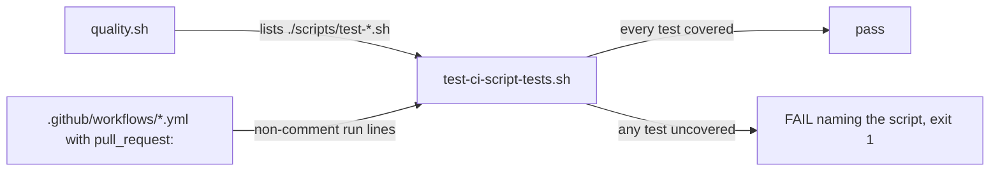

# PR summary — Issue #32: `scripts/test-cargo-update-quarantined.sh` is not run by any CI workflow

## Summary

Closes #32

- `.github/workflows/shellcheck.yml` gains a pull-request step that runs
  `./scripts/test-cargo-update-quarantined.sh`, so the quarantined
  `cargo update` helper's tests now run in CI as well as in `./quality.sh`.
- `scripts/test-ci-script-tests.sh` (new) stops this drift from recurring.
  It fails when any `./scripts/test-*.sh` that `quality.sh` runs is not run,
  on a non-comment line, by a workflow that triggers on `pull_request`.
  Self-tests (a)–(h) check the function before it checks the repository.
  `quality.sh` and `shellcheck.yml` both run it.
- `CONTRIBUTING.md` no longer makes the bare claim that "CI runs the same
  checks". It now says each script test has a pull-request workflow step,
  enforced by the new test.
- `README.md` no longer says that no workflow runs the script. Its gate list,
  CI paragraph and workflow table name every script test and the workflow
  that runs it.

## Spec

### Intent and Rationale

- `quality.sh` ran `test-cargo-update-quarantined.sh` but no workflow did.
  A change that broke the helper could go green in CI.
- CONTRIBUTING.md's "CI runs the same checks" was false. The README even
  documented the gap.
- A guard that compares `quality.sh` with the workflows turns the next gap
  into a red gate rather than a stale sentence.

### Essential Design Decisions

- The step goes in the existing `shellcheck.yml`, which already runs the
  other script unit test. No new workflow, permissions or action SHAs are
  added.
- The guard is a repo-local Bash script. It is not a shared action, because
  the repository owns its gates.
- Only `pull_request:` counts. `pull_request_target:`, `push` and `schedule`
  do not gate a PR in the same way, and a mention in a comment does not run
  anything.
- A missing `quality.sh`, a missing workflows directory or zero listed tests
  exits 2 with a message. None of them passes silently.

### Undiscoverable Facts

- `test-runlib.sh` is already covered by `family-sync.yml:142` (the
  `runlib-contract` job), so it needs no new step.
- The flow form `on: [pull_request]` is not detected as a pull-request
  trigger. Every workflow here uses the block form. If one ever used the flow
  form, the guard would fail loud rather than pass silently.

## Evidence

Backend and CI only, with no visual surface.

**Docs sweep** — grep: `test-cargo-update-quarantined`, `test-ci-script-tests`, `test-runlib`, `test-script-refs`, `shellcheck.yml`, `quality.sh`, "CI runs the same checks", "no workflow runs it"; section: `README.md#build-and-quality-gate`, `README.md#ci-workflows`, `CONTRIBUTING.md#branches-and-pull-requests`; updated: `README.md`, `CONTRIBUTING.md`

I grepped those names and phrases across `README.md`, `CONTRIBUTING.md`,
`SECURITY.md`, `AGENTS.md`, `scripts/` and `.github/`. `docs/` holds only
`docs/archive/`, which I excluded, and there is no `*/README.md`. I read the
three sections named above through at the head. Each one matches
`quality.sh:45-54`, `shellcheck.yml:61-65` and `family-sync.yml:142`. These
hits are outside the diff:

- `README.md:203` — still true, because it only names `./quality.sh` as the
  source of install hints for missing tools.
- `README.md:212` — still true, because it is the inline comment on the
  `./quality.sh` command.
- `README.md:260` — still true, because it is about RUSTFLAGS portability.
- `CONTRIBUTING.md:57` — still true, because benchmarks never run in
  `quality.sh` or PR CI.

**Related existing rules checked:**

- CONTRIBUTING.md's gate and CI sentence (line 17) was corrected in this
  diff.
- CONTRIBUTING.md's benchmark rule (line 57) still agrees.
- The README gate list and CI table were updated to match.
- AGENTS.md ("run `./quality.sh`, never weaken a gate") agrees: no gate was
  weakened, and one was added.

**Workflow-validator rule applied to this PR's own diff.** The
`shellcheck.yml` change adds a load-bearing step. `test-ci-script-tests.sh`
is the validator for that invariant. It has positive self-test (a) and
negative self-tests (b)–(h), and it runs against the real workflows. I also
read the diff against the rule. Both new workflow steps, `shellcheck.yml:62`
and `shellcheck.yml:64`, are covered by the validator, which passes at the
head. I found no gap.

## Test Plan

- [x] `bash -n` and `shellcheck -x --severity=style` on
  `scripts/test-ci-script-tests.sh` and `quality.sh`: clean.
- [x] `actionlint .github/workflows/shellcheck.yml`: clean.
- [x] `./scripts/test-ci-script-tests.sh`,
  `./scripts/test-cargo-update-quarantined.sh` and
  `./scripts/test-script-refs.sh`: all pass.
- [x] Red run against the base: I combined `origin/Develop`'s
  `.github/workflows` with this branch's `quality.sh` and validator. The
  validator failed (rc=1) naming `./scripts/test-cargo-update-quarantined.sh`
  and `./scripts/test-ci-script-tests.sh`.
- [x] Red run on the fix: removing the cargo-update step from
  `shellcheck.yml` made the validator fail, naming that script (exit 1).
  Restored.
- [x] Full `./quality.sh < /dev/null`: rc=0, "All quality checks passed".
  This includes the new issue #32 step, cargo deny and cargo audit.
- [x] markdownlint and spell-check on the changed docs: clean.
- Removed assertions: none.

**Branch outcomes:** each flip below was made on purpose and restored
byte-identical afterwards.

- `scripts/test-ci-script-tests.sh:24` — missing `quality.sh` exits 2 with
  "missing …/quality.sh". Reached by self-test (g); removing the guard went
  red.
- `scripts/test-ci-script-tests.sh:28` — missing `.github/workflows` exits 2
  with "missing …/.github/workflows". Reached by self-test (h); removing the
  guard went red (status 0 plus a `find` error).
- `scripts/test-ci-script-tests.sh:43` — zero listed tests exits 2. Reached
  by self-test (f); removing the guard went red.
- `scripts/test-ci-script-tests.sh:55` — only `pull_request:` workflows
  count. Reached by self-tests (c) (push and schedule only) and (d)
  (`pull_request_target` only); dropping the filter went red.
- `scripts/test-ci-script-tests.sh:71` — comment lines are skipped. Reached
  by self-test (e); counting comments went red.
- `scripts/test-ci-script-tests.sh:81` — an uncovered test is printed, and a
  covered test prints nothing. Reached by self-tests (b) and (a); flipping
  the coverage result went red.
- `scripts/test-ci-script-tests.sh:276` — the real-repository check fails
  with exit 1. Reached by running it on the base workflows (red, above) and
  on the head workflows (green).

All named tests exist at the head: `scripts/test-ci-script-tests.sh`,
`scripts/test-cargo-update-quarantined.sh` and
`scripts/test-script-refs.sh`.

🤖 Generated with [Claude Code](https://claude.com/claude-code)
